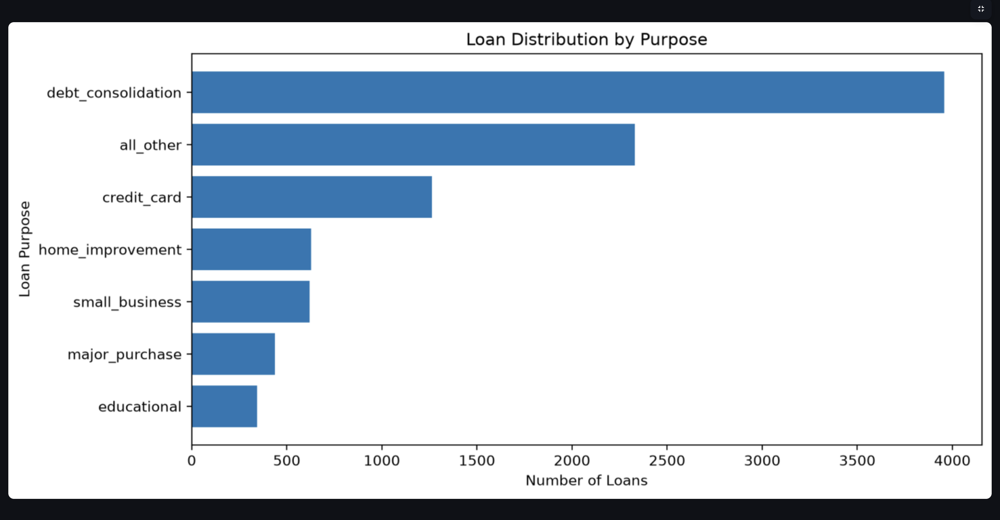
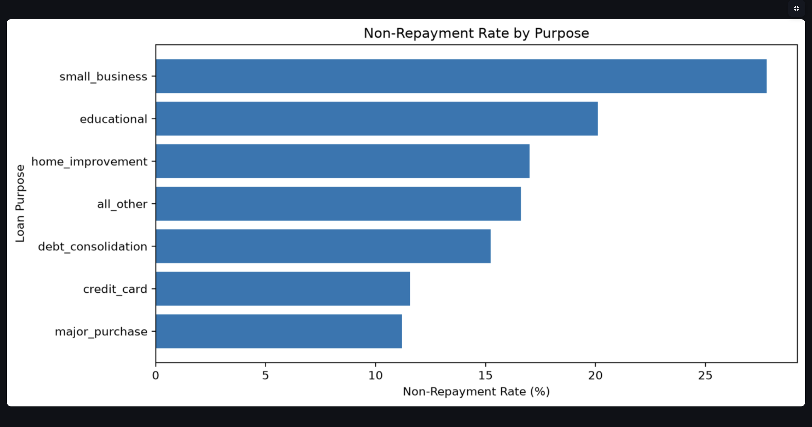
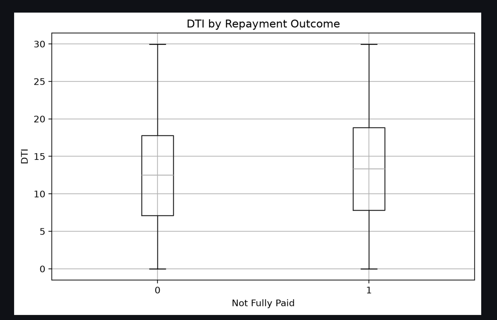
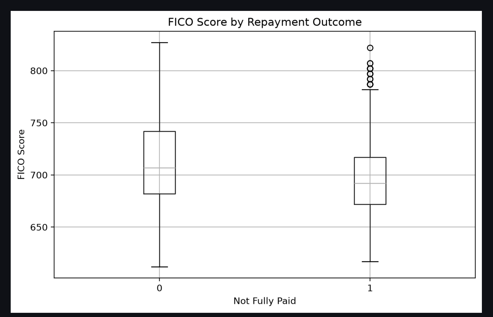

# Loan Default Risk Analyzer

An end-to-end data analytics and machine learning project that analyzes historical loan repayment data, identifies patterns associated with non-repayment, and presents the analysis through an interactive Streamlit dashboard.

---

## Project Overview

Lending is a highly data-driven industry where organizations need to understand repayment behavior, portfolio performance, and borrower characteristics.

I wanted to build a project that goes beyond basic data visualization and demonstrates how different data skills can work together to solve a practical business problem.

While learning Python, SQL, data analytics, and machine learning, I wanted to apply these skills to one end-to-end business problem. Loan repayment provided a clear business outcome and a meaningful set of borrower and loan characteristics to analyze.

This project combines:

- Python for data processing and analysis
- SQL for business-oriented analysis
- Exploratory Data Analysis (EDA)
- Machine Learning for predictive modeling
- Streamlit for interactive visualization

---

## Why This Project?

The idea behind this project was to understand how historical loan data can be transformed into useful business insights.

In a lending environment, analysts and risk teams may need to answer questions such as:

- What is the overall non-repayment rate?
- Which loan purposes have different repayment patterns?
- How does FICO score relate to repayment outcomes?
- How does debt-to-income ratio relate to repayment behavior?
- Does interest rate vary across different loan segments?
- How do credit inquiries relate to repayment outcomes?
- Which borrower segments show different historical repayment behavior?
- Can machine learning identify patterns associated with repayment outcomes?

I wanted to build a project where SQL, Python, visualization, and machine learning were not separate exercises, but different stages of the same analytical workflow.

---

# What Does the Project Do?

The **Loan Default Risk Analyzer** analyzes historical loan-level data to understand factors associated with loans that were not fully repaid.

The project performs four major functions:

### 1. Data Analysis

The dataset is explored using Python and Pandas to understand:

- Dataset structure
- Data types
- Missing values
- Target distribution
- Numerical variables
- Categorical variables
- Relationships between borrower characteristics and repayment outcomes

### 2. SQL Business Analysis

SQLite is used to answer business-oriented questions through SQL queries.

Examples include:

- Loan volume by purpose
- Non-repayment rate
- Average interest rate
- FICO segmentation
- DTI segmentation
- Credit inquiry analysis
- Public-record analysis
- High-interest loan analysis
- Higher-risk borrower segmentation

### 3. Machine Learning

Two classification models are developed:

- Logistic Regression
- Random Forest

The models attempt to distinguish between:

```text
0 → Fully Paid
1 → Not Fully Paid
```

Models are evaluated using multiple classification metrics rather than relying only on accuracy.

### 4. Interactive Dashboard

A Streamlit dashboard brings the analysis together into an interactive interface containing:

- Portfolio KPIs
- Loan distribution
- Non-repayment analysis
- FICO analysis
- DTI analysis
- Risk segmentation
- Machine learning model comparison

---

# Real-World Use Case

This project demonstrates an analytical workflow that could be adapted to real-world lending and financial-services environments.

Imagine a bank or lending company has historical and current loan data.

The analytical workflow could look like:

```text
Loan Data
    │
    ▼
Data Validation & Preparation
    │
    ▼
SQL / Python Analysis
    │
    ├───────────────┐
    ▼               ▼
Portfolio       Borrower
Analysis        Segmentation
    │               │
    └───────┬───────┘
            ▼
      Machine Learning
            │
            ▼
     Risk Analysis
            │
            ▼
    Interactive Dashboard
            │
            ▼
  Analytics / Risk / Business Teams
```

A production system could receive data from databases, data warehouses, ETL pipelines, APIs, or other enterprise systems instead of a static CSV file.

The analysis could then be used to investigate:

- Portfolio performance
- Repayment patterns
- Borrower segments
- Risk concentrations
- Historical trends
- Predictive model outputs

The current project is a portfolio implementation using historical Kaggle data and is not intended to make actual lending decisions.

---

# Potential Industry Applications

## Banking & Financial Services

Potential applications include:

- Credit risk analytics
- Loan portfolio monitoring
- Repayment behavior analysis
- Borrower segmentation
- Risk reporting
- Predictive risk modeling

## NBFCs & Lending Companies

Potential applications include:

- Loan performance analysis
- Portfolio segmentation
- Risk investigation
- Repayment trend analysis
- Predictive modeling

## Fintech & Digital Lending

Potential applications include:

- Customer risk analytics
- Digital lending portfolio monitoring
- Repayment behavior analysis
- Customer segmentation
- Data-driven risk modeling

## Consumer Finance

Similar analytical approaches can be applied to:

- Consumer loans
- Product financing
- Credit portfolios
- Installment-based lending

---

# Potential Business Impact

The project demonstrates how raw financial data can be transformed into:

```text
Raw Data
   ↓
Data Analysis
   ↓
Business Insights
   ↓
Risk Segmentation
   ↓
Predictive Modeling
   ↓
Interactive Reporting
```

In a real-world lending environment, similar analytics could support teams in:

- Monitoring loan portfolios
- Investigating repayment patterns
- Identifying segments with different historical outcomes
- Comparing portfolio performance
- Developing predictive risk models
- Supporting data-driven business discussions

The project itself does not approve or reject loans. It demonstrates an analytical and predictive workflow that could support broader lending-risk processes.

---

# Dataset

This project uses the Lending Club loan dataset containing borrower financial and credit-related information.

**Original Dataset:** [Lending Club Data — Kaggle](https://www.kaggle.com/datasets/braindeadcoder/lending-club-data)

The raw dataset is not included in this repository because the Kaggle dataset page currently does not provide a clearly identifiable redistribution license.

To reproduce the analysis:

1. Download the dataset from the original Kaggle source.
2. Place the CSV file at:
   `data/loan_data.csv`
3. Run the notebooks in the recommended order.

The dataset contains loan-level information including:

- Loan purpose
- Interest rate
- Installment
- Annual income (log-transformed)
- Debt-to-income ratio (DTI)
- FICO score
- Credit line history
- Revolving balance
- Revolving utilization
- Recent credit inquiries
- Delinquencies
- Public records
- Loan repayment outcome

## Target Variable

The target variable is:

```text
not.fully.paid
```

Where:

```text
0 → Fully Paid
1 → Not Fully Paid
```

> **Dataset source:** [Lending Club Data — Kaggle](https://www.kaggle.com/datasets/braindeadcoder/lending-club-data)

---

# Technologies Used

| Technology | Purpose |
|---|---|
| Python | Data analysis and machine learning |
| Pandas | Data manipulation and analysis |
| NumPy | Numerical operations |
| Matplotlib | Data visualization |
| SQLite | SQL-based business analysis |
| Scikit-learn | Machine learning |
| Streamlit | Interactive dashboard |
| Jupyter Notebook | Analysis and experimentation |
| Git / GitHub | Version control and project hosting |

---

# Project Workflow

```text
                  Historical Loan Data
                           │
                           ▼
                  Data Understanding
                           │
                           ▼
              Exploratory Data Analysis
                           │
                           ▼
                    SQL Analysis
                           │
                           ▼
                  Risk Segmentation
                           │
                           ▼
                Machine Learning Models
                    ┌──────┴──────┐
                    ▼             ▼
             Logistic          Random
             Regression        Forest
                    │             │
                    └──────┬──────┘
                           ▼
                    Model Comparison
                           │
                           ▼
                 Streamlit Dashboard
```

---

# Data Analysis

## Data Understanding

The dataset was inspected for:

- Dataset dimensions
- Data types
- Missing values
- Duplicate records
- Numerical variables
- Categorical variables
- Target variable distribution

The dataset contains **9,578 loan records and 14 columns**.

---

# Exploratory Data Analysis

The project analyzes several dimensions of loan repayment behavior.

### Loan Purpose

Loan volumes are analyzed across different purposes to understand the composition of the loan portfolio.

### Repayment Outcome

The project compares:

- Fully paid loans
- Loans that were not fully paid

### FICO Score

FICO scores are analyzed across repayment outcomes and segmented into groups for risk-oriented analysis.

### Debt-to-Income Ratio

DTI is analyzed to understand how borrower debt burden differs across repayment outcomes.

### Interest Rate

Interest rates are analyzed across:

- Loan purposes
- Repayment outcomes
- Higher-interest loan segments

### Credit Inquiries

Recent credit inquiries are grouped into categories to investigate differences in historical repayment outcomes.

### Public Records

Public-record information is analyzed to compare repayment outcomes between loans with and without recorded public records.

---

# SQL Analysis

SQLite was used to perform business-oriented analysis.

The SQL analysis includes:

- Overall loan volume
- Repayment outcomes
- Overall non-repayment rate
- Loan count by purpose
- Average interest rate by purpose
- Non-repayment rate by purpose
- FICO analysis
- DTI analysis
- Credit policy analysis
- FICO risk segmentation
- DTI risk segmentation
- Higher-risk borrower segmentation
- High-interest loan analysis
- Small-business loan analysis
- Credit inquiry analysis
- Public-record analysis
- Combined loan-purpose and repayment analysis

SQL queries are available in:

```text
sql/business_queries.sql
```

---

# Machine Learning

The machine learning component treats loan repayment as a binary classification problem.

## Target

```text
not.fully.paid
```

### Classes

```text
0 → Fully Paid
1 → Not Fully Paid
```

---

## Data Preparation

The project uses:

- Train/test split
- Stratified sampling
- Feature scaling
- One-hot encoding
- Pipeline-based preprocessing

Categorical features such as `purpose` are one-hot encoded.

Numerical features are standardized using `StandardScaler`.

---

# Model 1 — Logistic Regression

Logistic Regression was implemented as an interpretable baseline classification model.

The model is useful for understanding the relationship between input features and the predicted classification outcome.

The project also extracts Logistic Regression coefficients to examine feature contributions.

Feature coefficients are stored in:

```text
data/logistic_feature_importance.csv
```

---

# Model 2 — Random Forest

A Random Forest classifier was also developed.

Random Forest can capture nonlinear relationships between borrower and loan characteristics.

The model uses:

- Multiple decision trees
- Class balancing
- 200 estimators
- Parallel processing

---

## Model Evaluation

Two classification models were evaluated using Accuracy, Precision, Recall, F1 Score, and ROC-AUC.

| Model | Accuracy | Precision | Recall | F1 Score | ROC-AUC |
|---|---:|---:|---:|---:|---:|
| Logistic Regression | 65.40% | 25.14% | 58.63% | 35.19% | 0.677 |
| Random Forest | 81.78% | 33.85% | 14.33% | 20.14% | 0.646 |

### Model Comparison

- **Random Forest** achieved higher overall accuracy at **81.78%**.
- **Logistic Regression** achieved substantially higher recall (**58.63% vs 14.33%**), meaning it identified more of the loans that were actually not fully paid.
- Logistic Regression also achieved a higher **F1 Score (35.19%)** and **ROC-AUC (0.677)** than Random Forest.
- For a loan-risk use case, accuracy alone can be misleading because missing risky loans can be costly. Therefore, **recall and ROC-AUC are important evaluation metrics alongside accuracy**.
- Based on these evaluation results, **Logistic Regression provides the stronger baseline for identifying potential non-repayment cases**, while Random Forest demonstrates higher overall classification accuracy but substantially lower recall.

The model comparison results are also saved in:

`data/model_comparison.csv`

---

# Interactive Streamlit Dashboard

The project includes an interactive Streamlit dashboard designed to make the analysis easier to explore.

The dashboard contains:

### Portfolio KPIs

- Total loans
- Fully paid loans
- Not fully paid loans
- Non-repayment rate

### Loan Analysis

- Loan distribution by purpose
- Non-repayment rate by purpose

### Borrower Analysis

- FICO score distribution
- DTI distribution

### Risk Segmentation

The dashboard includes project-defined analytical risk segments based on FICO and DTI.

These segments are intended for analytical exploration and are **not official credit-risk classifications**.

### Machine Learning

The dashboard also displays the comparison between:

- Logistic Regression
- Random Forest

---

## Dashboard Preview

The Streamlit dashboard provides an interactive view of the loan portfolio, repayment behavior, and borrower characteristics.

### Loan Portfolio Distribution



The portfolio is concentrated in **debt consolidation**, followed by **all other** and **credit card** loans.

### Non-Repayment Rate by Loan Purpose



The historical data shows that **small-business loans have the highest non-repayment rate** among the displayed purposes, while **major purchase** and **credit card** loans have lower rates.

### DTI by Repayment Outcome



The boxplot compares debt-to-income distributions between fully paid and not-fully-paid loans. The not-fully-paid group has a somewhat higher median DTI, indicating a relationship worth investigating further.

### FICO Score by Repayment Outcome



The not-fully-paid group has a lower median FICO score than the fully paid group, while also showing several high-score outliers.

> These observations describe patterns in the historical dataset and should not be interpreted as causal relationships or as standalone lending decisions.

---

# Project Structure


```text
Loan Default Risk Analyzer/
│
├── app.py
├── README.md
├── requirements.txt
├── .gitignore
│
├── data/
│   ├── loan_data.csv
│   ├── model_comparison.csv
│   └── logistic_feature_importance.csv
│
├── docs/
│   ├── dashboard-overview.png
│   ├── non-repayment-by-purpose.png
│   ├── dti-by-outcome.png
│   └── fico-by-outcome.png
│
├── notebooks/
│   ├── 01_data_understanding.ipynb
│   ├── 03_sql_analysis.ipynb
│   ├── 04_machine_learning.ipynb
│   └── 05_final_analysis.ipynb
│
└── sql/
    └── business_queries.sql
```


---

# How to Run the Project

## 1. Clone the Repository

```bash
git clone git@github.com:Nuke-Master/loan-default-risk-analyzer.git
```

Move into the project:

```bash
cd loan-default-risk-analyzer
```

---

## 2. Create a Virtual Environment

```bash
python3 -m venv .venv
```

Activate it:

### macOS / Linux

```bash
source .venv/bin/activate
```

### Windows

```bash
.venv\Scripts\activate
```

---

## 3. Install Dependencies

```bash
pip install -r requirements.txt
```

---

## 4. Run the Streamlit Dashboard

```bash
streamlit run app.py
```

The dashboard will open in your browser.

---

# Notebooks

The project analysis is organized into Jupyter notebooks.

### `01_data_understanding.ipynb`

Covers:

- Dataset loading
- Dataset structure
- Data types
- Missing-value analysis
- Target analysis
- Initial exploration

### `03_sql_analysis.ipynb`

Covers:

- SQLite database creation
- SQL business queries
- Portfolio analysis
- Risk segmentation
- Repayment analysis

### `04_machine_learning.ipynb`

Covers:

- Feature preparation
- Train/test split
- Preprocessing
- Logistic Regression
- Random Forest
- Model evaluation
- Feature importance
- Model comparison

### `05_final_analysis.ipynb`

Covers:

- Final exploratory analysis
- Key visualizations
- FICO analysis
- DTI analysis
- Loan-purpose analysis
- Final project insights

---

# Key Skills Demonstrated

## Data Analytics

- Data cleaning
- Data exploration
- Descriptive analysis
- Segmentation
- Business-question-driven analysis
- Insight generation

## SQL

- SELECT
- GROUP BY
- CASE statements
- Conditional aggregation
- Filtering
- Aggregations
- Segmentation
- Business-oriented analysis

## Python

- Pandas
- NumPy
- Matplotlib
- Data preprocessing
- Feature transformation
- Data analysis

## Machine Learning

- Train/test split
- Stratified sampling
- Feature preprocessing
- One-hot encoding
- Feature scaling
- Logistic Regression
- Random Forest
- Classification metrics
- Model comparison

## Visualization

- Distribution analysis
- Boxplots
- Category comparisons
- Risk segmentation
- Interactive dashboards

## Software / Project Skills

- Jupyter Notebook
- Streamlit
- SQLite
- Git
- GitHub
- Virtual environments
- Requirements management

---

# What I Learned

This project helped me understand how different parts of a data project connect together.

Instead of treating Python, SQL, machine learning, and visualization as separate skills, the project combines them into one workflow:

```text
Business Problem
       ↓
Data
       ↓
SQL / Python
       ↓
Exploration
       ↓
Insights
       ↓
Machine Learning
       ↓
Model Evaluation
       ↓
Dashboard
       ↓
Business Communication
```

The project also reinforced the importance of selecting appropriate evaluation metrics rather than relying only on accuracy when working with an imbalanced classification problem.

---

# Future Improvements

Possible future improvements include:

- Add more comprehensive model validation
- Hyperparameter tuning
- Cross-validation
- Threshold optimization
- Model explainability using SHAP or similar techniques
- Additional borrower segmentation
- Time-based portfolio analysis
- Interactive dashboard filters
- Database-driven dashboard instead of CSV input
- Automated data-refresh pipeline
- Model monitoring
- Production-grade API deployment

---

# Limitations

This project has several limitations.

### Historical Dataset

The analysis is based on a historical Kaggle dataset and may not represent current lending behavior.

### Predictive Modeling

The machine learning models are developed for educational and portfolio purposes and have not undergone production-level validation.

### Risk Segmentation

The risk segments used in the dashboard are project-defined analytical segments based on selected FICO and DTI thresholds. They are not official banking or regulatory risk classifications.

### Lending Decisions

The model should not be used by itself to approve or reject real loan applications.

Real-world lending systems would require additional factors such as:

- Regulatory requirements
- Credit policies
- Fairness and bias testing
- Data-quality controls
- Model validation
- Monitoring
- Explainability
- Fraud detection
- Affordability assessment
- Human/business controls

---

# Disclaimer

This project is intended for **educational and portfolio purposes**.

The analysis and machine learning models demonstrate how historical loan data can be analyzed and modeled. The outputs should not be interpreted as actual lending recommendations, credit decisions, or financial advice.

---

# Author

**Mihir Mewada**

Data Analytics | Python | SQL | Machine Learning

GitHub:

https://github.com/Nuke-Master

---

## Project Repository

**Loan Default Risk Analyzer**

https://github.com/Nuke-Master/loan-default-risk-analyzer